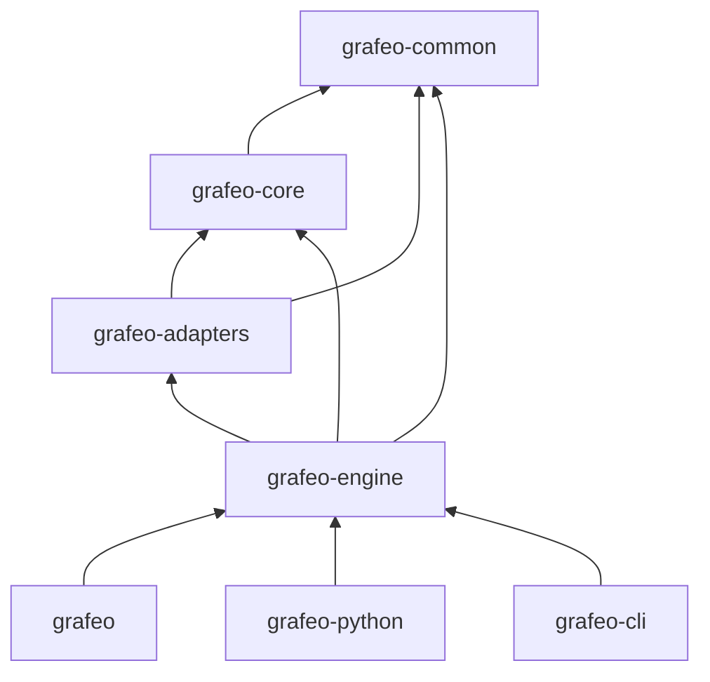

# Crate Structure

Grafeo is organized into seven crates with clear responsibilities.

## Dependency Graph



## grafeo

Top-level facade crate that re-exports the public API.

| Module | Purpose |
|--------|---------|
| `lib.rs` | Re-exports from grafeo-engine |

```rust
use grafeo::GrafeoDB;

let db = GrafeoDB::new_in_memory();
```

## grafeo-common

Foundation types and utilities.

| Module | Purpose |
|--------|---------|
| `types/` | NodeId, EdgeId, Value, LogicalType |
| `memory/` | Arena allocator, memory pools |
| `utils/` | Hashing, error types |

```rust
use grafeo_common::types::{NodeId, Value};
use grafeo_common::memory::Arena;
```

## grafeo-core

Core data structures and execution engine.

| Module | Purpose |
|--------|---------|
| `graph/lpg/` | LPG storage (nodes, edges, properties) |
| `index/` | Hash, B-tree, adjacency indexes |
| `execution/` | DataChunk, operators, pipelines |

```rust
use grafeo_core::graph::LpgStore;
use grafeo_core::index::BTreeIndex;
use grafeo_core::execution::DataChunk;
```

## grafeo-adapters

External interfaces and adapters.

| Module | Purpose |
|--------|---------|
| `query/gql/` | GQL parser (lexer, parser, AST) |
| `query/cypher/` | Cypher compatibility layer |
| `storage/` | Storage backends (memory, WAL) |
| `plugins/` | Plugin system |

```rust
use grafeo_adapters::query::gql::GqlParser;
use grafeo_adapters::storage::WalBackend;
```

## grafeo-engine

Database facade and coordination.

| Module | Purpose |
|--------|---------|
| `database.rs` | GrafeoDB struct, lifecycle |
| `session.rs` | Session management |
| `query/` | Query processor, planner, optimizer |
| `transaction/` | Transaction manager, MVCC |

```rust
use grafeo_engine::{GrafeoDB, Session, Config};
```

## grafeo-python

Python bindings via PyO3. Located at `crates/bindings/python`.

| Module | Purpose |
|--------|---------|
| `database.rs` | PyGrafeoDB class |
| `query.rs` | Query execution |
| `types.rs` | Type conversions |

```python
import grafeo
db = grafeo.GrafeoDB()
```

## grafeo-cli

Command-line interface for database administration.

| Module | Purpose |
|--------|---------|
| `commands/` | CLI command implementations |
| `output.rs` | Output formatting (table, JSON) |

```bash
grafeo info ./mydb
grafeo stats ./mydb --format json
```

## Crate Guidelines

1. **No cyclic dependencies** - Strict layering
2. **Public API minimization** - Only expose what's needed
3. **Feature flags** - Optional functionality gated by features
4. **Documentation** - All public items documented
