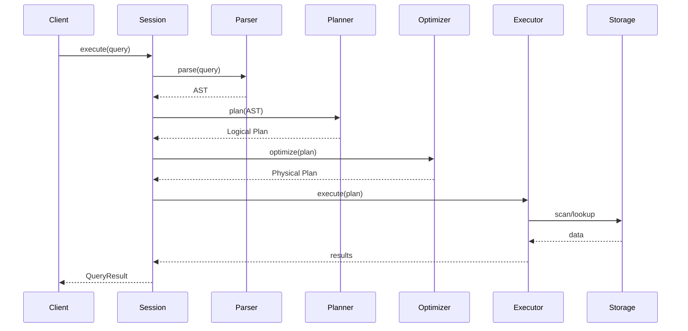

# System Overview

Grafeo is designed as a high-performance, embeddable graph database.

## Design Goals

| Goal | Approach |
|------|----------|
| **Performance** | Vectorized execution, SIMD, columnar storage |
| **Embeddability** | No external dependencies, single library |
| **Safety** | Pure Rust, memory-safe by design |
| **Flexibility** | Plugin architecture, multiple storage backends |

## Query Flow

## Key Components

### Query Processing

1. **Parser** - GQL/Cypher to AST
2. **Binder** - Semantic analysis and type checking
3. **Planner** - AST to logical plan
4. **Optimizer** - Cost-based optimization
5. **Executor** - Push-based execution

### Storage

1. **LPG Store** - Node and edge storage
2. **Property Store** - Columnar property storage
3. **Indexes** - Hash, B-tree, adjacency
4. **WAL** - Durability and recovery

### Memory

1. **Buffer Manager** - Memory allocation
2. **Arena Allocator** - Epoch-based allocation
3. **Spill Manager** - Disk spilling for large operations

## Threading Model

- **Main Thread** - Coordinates query execution
- **Worker Threads** - Parallel query processing (morsel-driven)
- **Background Thread** - Checkpointing, compaction

## Implementation Status

All major features are implemented:

| Phase | Features | Status |
| ----- | -------- | ------ |
| **Phase 1: Foundation** | Zone Maps, Dictionary Encoding, Cost-Based Join (DPccp), Statistics Collection | ✅ Complete |
| **Phase 2: Memory & Execution** | Unified Buffer Manager, Push-Based Execution, Adaptive Chunk Sizing, Adjacency Compression | ✅ Complete |
| **Phase 3: Parallelism** | Morsel Scheduler, Transparent Spilling, Auto Thread Detection | ✅ Complete |
| **Phase 4: Polish** | Integer Compression, Bloom Filters, Histograms, RLE, Property Compression, Adaptive Execution | ✅ Complete |

## Performance Targets

| Metric | Target |
| ------ | ------ |
| Insert throughput | 1M nodes/sec |
| Edge insert | 500K edges/sec |
| Point lookup | < 1μs |
| 1-hop traversal | < 10μs |
| 2-hop traversal | < 100μs |
| Triangle query | < 1ms/1K triangles |
| PageRank (1M nodes) | < 1s |
| Memory overhead | < 100 bytes/node |
