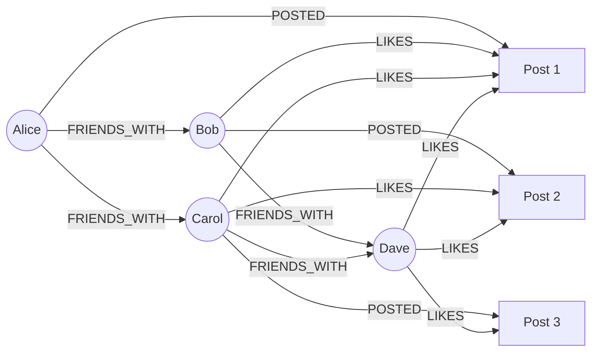

# Your First Graph

In this tutorial, you'll build a simple social network graph to learn the fundamentals of Grafeo.

## What We'll Build

A social network with:

- **People** with names, ages, and locations
- **Friendships** between people
- **Posts** created by people
- **Likes** on posts

## Step 1: Create the Database

=== "Python"

    ```python
    import grafeo

    # Create a persistent database
    db = grafeo.GrafeoDB(path="social_network.db")
    ```

=== "Rust"

    ```rust
    use grafeo::Database;

    let db = Database::open("social_network.db")?;
    ```

## Step 2: Add People

=== "Python"

    ```python
    with db.session() as session:
        session.execute("""
            INSERT (:Person {
                name: 'Alice',
                age: 30,
                location: 'New York'
            })
            INSERT (:Person {
                name: 'Bob',
                age: 25,
                location: 'San Francisco'
            })
            INSERT (:Person {
                name: 'Carol',
                age: 35,
                location: 'New York'
            })
            INSERT (:Person {
                name: 'Dave',
                age: 28,
                location: 'Los Angeles'
            })
        """)
    ```

=== "Rust"

    ```rust
    let session = db.session()?;

    session.execute(r#"
        INSERT (:Person {
            name: 'Alice',
            age: 30,
            location: 'New York'
        })
        INSERT (:Person {
            name: 'Bob',
            age: 25,
            location: 'San Francisco'
        })
        INSERT (:Person {
            name: 'Carol',
            age: 35,
            location: 'New York'
        })
        INSERT (:Person {
            name: 'Dave',
            age: 28,
            location: 'Los Angeles'
        })
    "#)?;
    ```

## Step 3: Create Friendships

=== "Python"

    ```python
    with db.session() as session:
        # Alice knows Bob and Carol
        session.execute("""
            MATCH (a:Person {name: 'Alice'}), (b:Person {name: 'Bob'})
            INSERT (a)-[:FRIENDS_WITH {since: 2020}]->(b)
        """)

        session.execute("""
            MATCH (a:Person {name: 'Alice'}), (c:Person {name: 'Carol'})
            INSERT (a)-[:FRIENDS_WITH {since: 2019}]->(c)
        """)

        # Bob knows Dave
        session.execute("""
            MATCH (b:Person {name: 'Bob'}), (d:Person {name: 'Dave'})
            INSERT (b)-[:FRIENDS_WITH {since: 2021}]->(d)
        """)

        # Carol knows Dave
        session.execute("""
            MATCH (c:Person {name: 'Carol'}), (d:Person {name: 'Dave'})
            INSERT (c)-[:FRIENDS_WITH {since: 2022}]->(d)
        """)
    ```

=== "Rust"

    ```rust
    let session = db.session()?;

    session.execute(r#"
        MATCH (a:Person {name: 'Alice'}), (b:Person {name: 'Bob'})
        INSERT (a)-[:FRIENDS_WITH {since: 2020}]->(b)
    "#)?;

    session.execute(r#"
        MATCH (a:Person {name: 'Alice'}), (c:Person {name: 'Carol'})
        INSERT (a)-[:FRIENDS_WITH {since: 2019}]->(c)
    "#)?;

    session.execute(r#"
        MATCH (b:Person {name: 'Bob'}), (d:Person {name: 'Dave'})
        INSERT (b)-[:FRIENDS_WITH {since: 2021}]->(d)
    "#)?;

    session.execute(r#"
        MATCH (c:Person {name: 'Carol'}), (d:Person {name: 'Dave'})
        INSERT (c)-[:FRIENDS_WITH {since: 2022}]->(d)
    "#)?;
    ```

## Step 4: Add Posts

=== "Python"

    ```python
    with db.session() as session:
        session.execute("""
            INSERT (:Post {
                id: 1,
                content: 'Hello, world!',
                created_at: '2024-01-15'
            })
            INSERT (:Post {
                id: 2,
                content: 'Learning Grafeo is fun!',
                created_at: '2024-01-16'
            })
            INSERT (:Post {
                id: 3,
                content: 'Graph databases are amazing.',
                created_at: '2024-01-17'
            })
        """)

        # Connect posts to authors
        session.execute("""
            MATCH (a:Person {name: 'Alice'}), (p:Post {id: 1})
            INSERT (a)-[:POSTED]->(p)
        """)

        session.execute("""
            MATCH (b:Person {name: 'Bob'}), (p:Post {id: 2})
            INSERT (b)-[:POSTED]->(p)
        """)

        session.execute("""
            MATCH (c:Person {name: 'Carol'}), (p:Post {id: 3})
            INSERT (c)-[:POSTED]->(p)
        """)
    ```

## Step 5: Add Likes

=== "Python"

    ```python
    with db.session() as session:
        # Bob likes Alice's post
        session.execute("""
            MATCH (b:Person {name: 'Bob'}), (p:Post {id: 1})
            INSERT (b)-[:LIKES]->(p)
        """)

        # Carol likes Alice's and Bob's posts
        session.execute("""
            MATCH (c:Person {name: 'Carol'}), (p:Post)
            WHERE p.id IN [1, 2]
            INSERT (c)-[:LIKES]->(p)
        """)

        # Dave likes all posts
        session.execute("""
            MATCH (d:Person {name: 'Dave'}), (p:Post)
            INSERT (d)-[:LIKES]->(p)
        """)
    ```

## Step 6: Query the Graph

Now let's explore the social network:

### Find All Friends of Alice

=== "Python"

    ```python
    with db.session() as session:
        result = session.execute("""
            MATCH (a:Person {name: 'Alice'})-[:FRIENDS_WITH]->(friend)
            RETURN friend.name, friend.location
        """)

        print("Alice's friends:")
        for row in result:
            print(f"  - {row['friend.name']} from {row['friend.location']}")
    ```

### Find Friends of Friends

=== "Python"

    ```python
    with db.session() as session:
        result = session.execute("""
            MATCH (a:Person {name: 'Alice'})-[:FRIENDS_WITH]->()-[:FRIENDS_WITH]->(fof)
            WHERE fof <> a
            RETURN DISTINCT fof.name
        """)

        print("Friends of Alice's friends:")
        for row in result:
            print(f"  - {row['fof.name']}")
    ```

### Find People in the Same Location

=== "Python"

    ```python
    with db.session() as session:
        result = session.execute("""
            MATCH (p:Person)
            RETURN p.location AS location, collect(p.name) AS people
        """)

        print("People by location:")
        for row in result:
            print(f"  {row['location']}: {row['people']}")
    ```

### Find Most Liked Posts

=== "Python"

    ```python
    with db.session() as session:
        result = session.execute("""
            MATCH (p:Post)<-[:LIKES]-(person)
            MATCH (author)-[:POSTED]->(p)
            RETURN p.content AS post, author.name AS author, count(person) AS likes
            ORDER BY likes DESC
        """)

        print("Posts by popularity:")
        for row in result:
            print(f"  '{row['post']}' by {row['author']} - {row['likes']} likes")
    ```

### Find Mutual Friends

=== "Python"

    ```python
    with db.session() as session:
        result = session.execute("""
            MATCH (a:Person {name: 'Alice'})-[:FRIENDS_WITH]->(mutual)<-[:FRIENDS_WITH]-(b:Person {name: 'Bob'})
            RETURN mutual.name
        """)

        print("Mutual friends of Alice and Bob:")
        for row in result:
            print(f"  - {row['mutual.name']}")
    ```

## The Complete Graph

Here's a visualization of what we've built:



## Next Steps

Congratulations! You've built your first graph application. Continue learning:

- [Configuration](configuration.md) - Optimize your database
- [GQL Query Language](../user-guide/gql/index.md) - Master the query language
- [Tutorials](../tutorials/index.md) - More real-world examples
